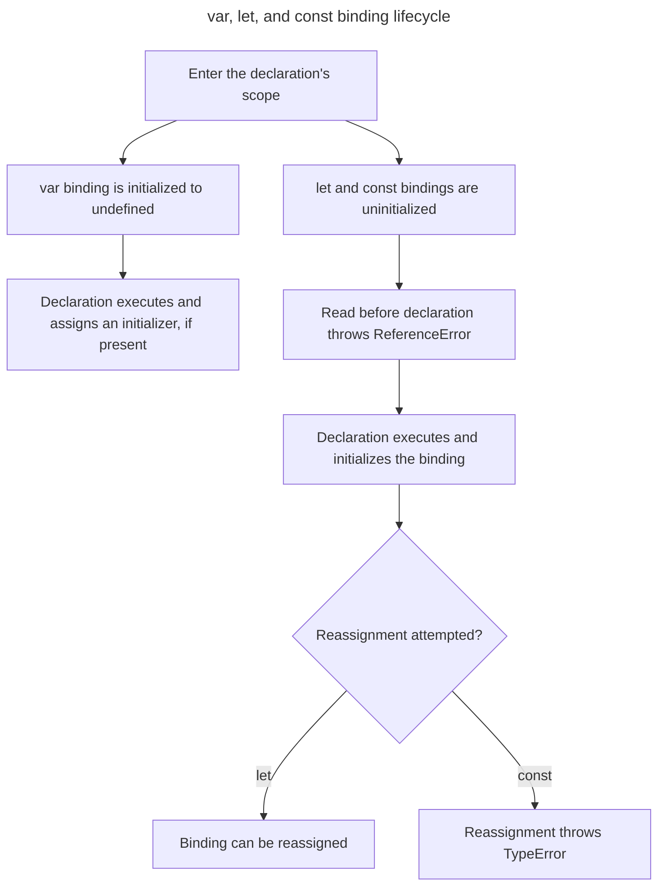

> [!info]
> 🟢 Difficulty: Medium
> 📂 Category: JavaScript Interview Question
> ⏱️ Review Time: ~5 minutes

---

## TL;DR

`let`, `var`, and `const` are all used to declare variables, but they differ in:

- Scope
- Initialization
- Redeclaration
- Reassignment
- Behavior when accessed before declaration

| Behavior | `var` | `let` | `const` |
|---|---|---|---|
| Scope | Function or Global | Block | Block |
| Initialization | Optional | Optional | Required |
| Redeclaration | Yes | No | No |
| Reassignment | Yes | Yes | No |
| Accessing before declaration | `undefined` | `ReferenceError` | `ReferenceError` |

---

## Interview Answer (30–60 sec)

> `var` is function-scoped, while `let` and `const` are block-scoped. `var` and `let` can be declared without an initial value, but `const` must be initialized when declared. `var` can be redeclared and reassigned, `let` can be reassigned but not redeclared in the same scope, and `const` can be neither redeclared nor reassigned. All three declarations are hoisted, but `var` is initialized to `undefined`, while `let` and `const` remain uninitialized in the Temporal Dead Zone until their declaration is reached. In modern JavaScript, I generally use `const` by default and `let` when reassignment is required, and avoid `var`.

---

## Key Takeaways

### `var`

- Function-scoped or global-scoped.
- Can be declared without an initializer.
- Can be redeclared.
- Can be reassigned.
- Hoisted and initialized to `undefined`.

### `let`

- Block-scoped.
- Can be declared without an initializer.
- Cannot be redeclared in the same scope.
- Can be reassigned.
- Hoisted but not initialized.
- Access before declaration causes a `ReferenceError` because of the Temporal Dead Zone (TDZ).

### `const`

- Block-scoped.
- Must be initialized when declared.
- Cannot be redeclared.
- Cannot be reassigned.
- Hoisted but not initialized.
- Access before declaration causes a `ReferenceError` because of the Temporal Dead Zone (TDZ).

### Important

`const` prevents **rebinding**, not object mutation.

```js
const user = {
  name: 'Rahul',
};

user.name = 'John'; // Allowed
```

The variable `user` still refers to the same object.

---

## 🧠 Mental Model

```text
var
├── function/global scope
├── can redeclare
├── can reassign
└── hoisted + initialized as undefined

let
├── block scope
├── cannot redeclare
├── can reassign
└── hoisted + uninitialized → TDZ

const
├── block scope
├── cannot redeclare
├── cannot reassign
└── hoisted + uninitialized → TDZ
```

---

## Common Interview Traps

### "let and const are not hoisted."

❌ Incorrect.

They are hoisted, but unlike `var`, their bindings are not initialized before the declaration is reached.

---

### "const makes an object immutable."

❌ Incorrect.

`const` prevents reassignment of the variable binding. The object itself can still be mutated.

---

### "`var` is block-scoped."

❌ Incorrect.

`var` is function-scoped (or global-scoped when declared outside a function).

---

### "`let` can be redeclared."

❌ Incorrect.

Redeclaring a `let` variable in the same scope causes a `SyntaxError`.

---

### "`const` cannot be changed at all."

❌ Not exactly.

The binding cannot be reassigned, but an object or array referenced by the binding can still be mutated.

---

## Common Follow-ups

- What is the difference between function scope and block scope?
- Are `let` and `const` hoisted?
- What is the Temporal Dead Zone?
- Why does `var` return `undefined` before its declaration?
- What happens when `let` is accessed before declaration?
- Can a `const` object be mutated?
- Can `var` be redeclared?
- Why is `var` generally avoided in modern JavaScript?
- What is the difference between redeclaration and reassignment?
- What happens when `var` is declared inside a loop?
- Why do `let` and `const` behave differently from `var` in loops?

---

## My Notes

- 

---

# Detailed Reference

## TL;DR

In JavaScript, `let`, `var`, and `const` are all keywords used to declare variables, but they differ significantly in terms of scope, initialization rules, whether they can be redeclared or reassigned, and the behavior when they are accessed before declaration:

| Behavior | `var` | `let` | `const` |
| --- | --- | --- | --- |
| Scope | Function or Global | Block | Block |
| Initialization | Optional | Optional | Required |
| Redeclaration | Yes | No | No |
| Reassignment | Yes | Yes | No |
| Accessing before declaration | `undefined` | `ReferenceError` | `ReferenceError` |

---

## Scope and initialization at a glance

The important difference is not whether a declaration is “moved”, but when its binding is created, initialized, and allowed to change.



`const` prevents rebinding; it does not make an object value immutable.

## Differences in behavior

Let's look at the difference in behavior between `var`, `let`, and `const`.

### Scope

Variables declared using the `var` keyword are scoped to the function in which they are created, or if created outside of any function, to the global object. `let` and `const` are _block scoped_, meaning they are only accessible within the nearest set of curly braces (function, if-else block, or for-loop).

```js
function foo() {

// All variables are accessible within functions.

var bar = 1;

let baz = 2;

const qux = 3;

console.log(bar); // 1

console.log(baz); // 2

console.log(qux); // 3

}

foo(); // Prints each variable successfully

console.log(bar); // ReferenceError: bar is not defined

console.log(baz); // ReferenceError: baz is not defined

console.log(qux); // ReferenceError: qux is not defined
```

In the following example, `bar` is accessible outside of the `if` block but `baz` and `qux` are not.

```js
if (true) {

var bar = 1;

let baz = 2;

const qux = 3;

}

// var variables are accessible anywhere in the function scope.

console.log(bar); // 1
// let and const variables are not accessible outside of the block they were defined in.

console.log(baz); // ReferenceError: baz is not defined

console.log(qux); // ReferenceError: qux is not defined
```

### Initialization

`var` and `let` variables can be initialized without a value but `const` declarations must be initialized.

```js
var foo; // Ok

let bar; // Ok

const baz; // SyntaxError: Missing initializer in const declaration
```

### Redeclaration

Redeclaring a variable with `var` will not throw an error, but `let` and `const` will.

```js
var foo = 1;

var foo = 2; // Ok

console.log(foo); // Should print 2, but SyntaxError from baz prevents the code executing.

let baz = 3;

let baz = 4; // Uncaught SyntaxError: Identifier 'baz' has already been declared
```

### Reassignment

`var` and `let` allow reassigning the variable's value while `const` does not.

```js
var foo = 1;

foo = 2; // This is fine.

let bar = 3;

bar = 4; // This is fine.

const baz = 5;

baz = 6; // Uncaught TypeError: Assignment to constant variable.
```

### Accessing before declaration

`var` ,`let` and `const` declared variables are all hoisted. `var` declared variables are auto-initialized with an `undefined` value. However, `let` and `const` variables are not initialized and accessing them before the declaration will result in a `ReferenceError` exception because they are in a "temporal dead zone" from the start of the block until the declaration is processed.

```js
console.log(foo); // undefined

var foo = 'foo';
console.log(baz); // ReferenceError: Cannot access 'baz' before initialization

let baz = 'baz';

console.log(bar); // ReferenceError: Cannot access 'bar' before initialization

const bar = 'bar';
```

## Notes

- In modern JavaScript, it's generally recommended to use `const` by default for variables that don't need to be reassigned. This promotes immutability and prevents accidental changes.

- Use `let` when you need to reassign a variable within its scope.

- Avoid using `var` due to its potential for scoping issues and hoisting behavior.

- If you need to target older browsers, write your code using `let`/`const`, and use a transpiler like Babel to compile your code to older syntax.

## Further reading

- [The Difference of "var" vs "let" vs "const" in JavaScript](https://medium.com/swlh/the-difference-of-var-vs-let-vs-const-in-javascript-abe37e214d66)
